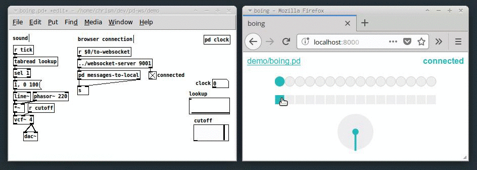

Communicate between Pure Data & web browser over a websocket.

Build browser based user interfaces for Pure Data DSP patches.

### tl;dr

 * Load up `websocket-server-help.pd` in Pd.
 * Load up `index.html` in your browser.

### What

Some things you could do with this:

 * Send messages from a web-app to Pd patches and visa versa.
 * Control a headless Raspberry Pi running Pd with a web-app on another machine.
 * Control a libpd patch running on a tablet or phone with a web-app in the devices's browser.

### Use

To build a web-app that talks to Pd instantiate the websocket-server in your patch:

	[websocket-server 9001]

Then connect from the browser:

	var ws = new WebSocket("ws://localhost:9001/");
	w.onmessage = console.log
	w.send(["hello", 42, "beep"]);

See the `websocket-server-help.pd` patch for more information.

### Notes

There is a known [bug](https://github.com/chr15m/pd-ws/issues/1) where refreshing the browser causes the connection to break. The current workaround is to bang the third inlet of the websocket before refreshing the browser.

### Acknowledgement

Based on the excellent [Websocket-Server-in-a-Patch by Nicolas Lhommet](https://sourceforge.net/projects/websocketserverinapatch/).
